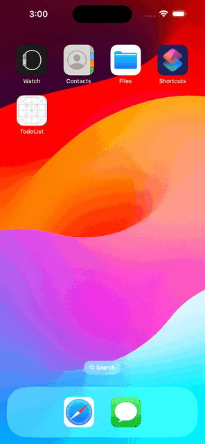

# GoGame




### Why Monorepo?

I chose a monorepo architecture for this project to streamline development and simplify management by bundling both the React Native app and the Express server into a single repository. While this is not the typical approach I would take for all projects, it suits this particular case well. The primary benefits of using a monorepo here are:

- **Unified Development**: Manage both front-end and back-end in one place, making coordination and integration easier.
- **Consistent Dependencies**: Ensure that both applications use compatible versions of shared libraries and tools.
- **Simplified Workflow**: Simplify the build and deployment processes by handling everything in a single repository.

### Running the project
To run both the Express server and the React Native app simultaneously, follow these steps:

### Prerequisites

Before running the project, make sure you have the following installed:

- [Node.js](https://nodejs.org/)
- [Yarn](https://yarnpkg.com/) or [NPM](https://www.npmjs.com/)
- [Expo CLI](https://docs.expo.dev/more/expo-cli/)
- [Xcode](https://developer.apple.com/xcode/)
- [Android Studio](https://developer.android.com/studio)
- [Nx](https://nx.dev/getting-started/installation) (Just in case)

### Setup

#### Install dependencies:

In the root directory of the project for both projects run:

```sh
npm run install
```

#### Build the server:

before running the server you may need to build it:

```sh
npx nx build server
```

### Running both applications

#### Start Metro Bundler and the iOS Simulator:

Use the following command to start Metro Bundler (for React Native) and run the iOS simulator:

```sh
npm run start:both:ios
```

This command will run:

- `npm run start:ios` – Starts the Metro Bundler for the React Native app.
- `npm run start:server` – Starts the Express server.

or same for android

```sh
npm run start:both:android
```

#### Access the Applications:

- **React Native App**: The Metro Bundler will open a development server. You can use Expo Go on your mobile device or an iOS simulator to run the app.
- **Express Server**: The server will be running on http://localhost:3333 (or the port specified in your server project configuration).

Or you can simply open a terminal and run a command for each project

Server:

```sh
npm run start:server
```

RN app:

```sh
npm run start:expo
```

You can run `npx nx graph` to visually explore what was created. (optional)

### Aditional Notes
- **Environment Variables**: Ensure you have the necessary environment variables set up for both the Express server and React Native app. Refer to the respective documentation for each project for more details on required variables.
- **Troubleshooting**: If you encounter issues, check the logs in your terminal for errors. Common problems might include missing dependencies, incorrect configurations, or issues with the development environment. Feel free to reach out to me at my personal email: estcascor94@gmail.com

## Install Nx Console

Nx Console is an editor extension that enriches your developer experience. It lets you run tasks, generate code, and improves code autocompletion in your IDE. It is available for VSCode and IntelliJ.

[Install Nx Console &raquo;](https://nx.dev/getting-started/editor-setup?utm_source=nx_project&utm_medium=readme&utm_campaign=nx_projects)

## Useful links

Learn more:

- [Learn more about this workspace setup](https://nx.dev/getting-started/intro#learn-nx?utm_source=nx_project&utm_medium=readme&utm_campaign=nx_projects)
- [Learn about Nx on CI](https://nx.dev/ci/intro/ci-with-nx?utm_source=nx_project&utm_medium=readme&utm_campaign=nx_projects)
- [Releasing Packages with Nx release](https://nx.dev/features/manage-releases?utm_source=nx_project&utm_medium=readme&utm_campaign=nx_projects)
- [What are Nx plugins?](https://nx.dev/concepts/nx-plugins?utm_source=nx_project&utm_medium=readme&utm_campaign=nx_projects)
